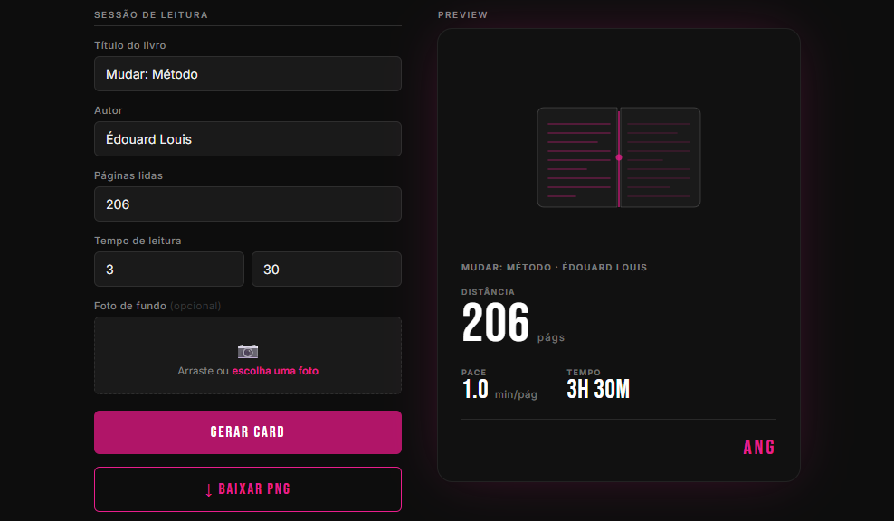

# Reading Stats

Para quem gosta das estatísticas do Strava > Um gerador de cartão de estatísticas de leitura, no estilo dos cards de atividade. 
Preencha o livro, as páginas lidas e o tempo da sessão e o site calcula o pace e monta um cartão pronto para exportar em PNG!



## Funcionalidades

- Cálculo automático de ritmo de leitura (min/página) e tempo total
- Foto de fundo opcional (pode colocar o seu gatinho no png!), por upload ou arrastar-e-soltar
- Preview ao vivo enquanto você digita
- Exportação do cartão em PNG (via [html2canvas](https://html2canvas.hertzen.com/))

## Como usar

Este é um projeto 100% estático (sem build, sem dependências para instalar), ou seja, só abrir o link e inserir seus dados (que eu não salvo em lugar algum).

1. Abra o [`index.html`](index.html) diretamente no navegador, **ou**
2. Sirva a pasta com qualquer servidor estático, por exemplo:
   ```bash
   npx serve .
   ```

## Stack

- HTML, CSS e JavaScript puros (sem framework)
- [html2canvas](https://html2canvas.hertzen.com/) para exportar o cartão como imagem
- Fontes [Bebas Neue](https://fonts.google.com/specimen/Bebas+Neue) e [Inter](https://fonts.google.com/specimen/Inter), via Google Fonts

## Estrutura

```
.
├── index.html        # marcação da página
├── css/style.css      # estilos e tokens de design
├── js/app.js           # lógica do formulário, cálculo e exportação
└── assets/            # favicon e imagens
```

## Licença

Distribuído sob a licença [MIT](LICENSE).
